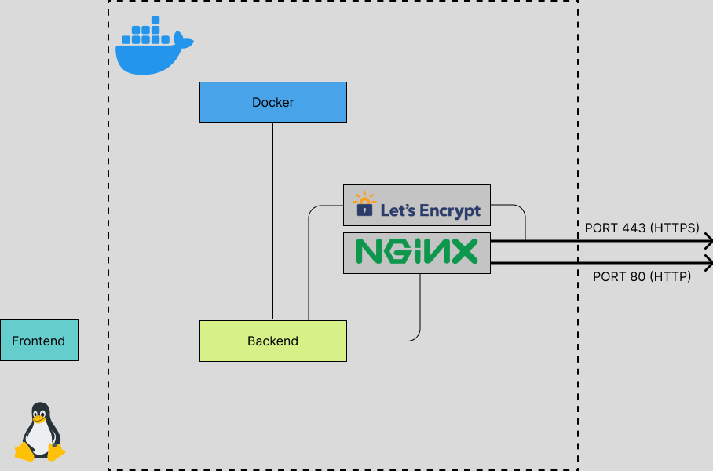

# paasify
Developer friendly PaaS (with simplicity kept in mind) 🚀



## Installation

The repository is a monorepo handled using Turborepo.

Obviously you have to do this:

```bash
yarn install
```

Note: Check the scripts in root `package.json`

I will surely add the installation step once the project starts stacking up.

## Usage

WIP

## Contributing
Pull requests are welcome. For major changes, please open an issue first to discuss what you would like to change.

Also, make sure to read the CONTRIBUTING and [CODE_OF_CONDUCT](./CODE_OF_CONDUCT.md) guidelines.

## License
[MIT](/LICENSE)